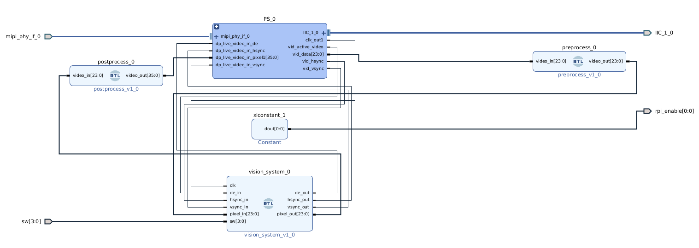

# FPGA Hand Centroid Detection on Xilinx Kria

This project implements a hardware-based algorithm for detecting the centroid (center of mass) of a human hand in a binary image. It uses contextual operations, color space conversion (RGB to YCbCr), thresholding, and optional 5x5 median filtering — all in Verilog, targeting the Xilinx Kria (KV260) FPGA platform.

## 🔍 Dłoń – kolejne fazy przetwarzania

  
  
  
  
  
  
  

---

## Features
- Real-time video input from camera
- Binary segmentation using YCbCr thresholding or LUT
- Median filtering (optional)
- Centroid calculation of white objects
- Switch-selectable output visualization

## Getting Started

1. Open Vivado 2022.2 or compatible.
2. Load the `video_passthrough_kria.xpr` project file.
3. Generate bitstream and export hardware with `.xsa`.
4. Load design via Vitis or JTAG.

### Switch Control (`sw[3:0]`)
| sw | Output Channel                  |
|----|---------------------------------|
| 0  | Raw video passthrough           |
| 1  | YCbCr color-converted image     |
| 2  | LUT binarized (RGB thresholding)|
| 3  | YCbCr binarized                 |
| 4  | Centroid marked (YCbCr mask)    |
| 5  | Median filtered mask            |
| 6  | Centroid after median filter    |

---

## 📷 Diagram systemu

  

---

## Dependencies
- Vivado 2022.2
- Xilinx Kria KV260 (or compatible)
- MIPI camera module (e.g., OV5640)

🛠️ Project created for academic purposes during the *Reconfigurable Systems* course at AGH Cracow.
